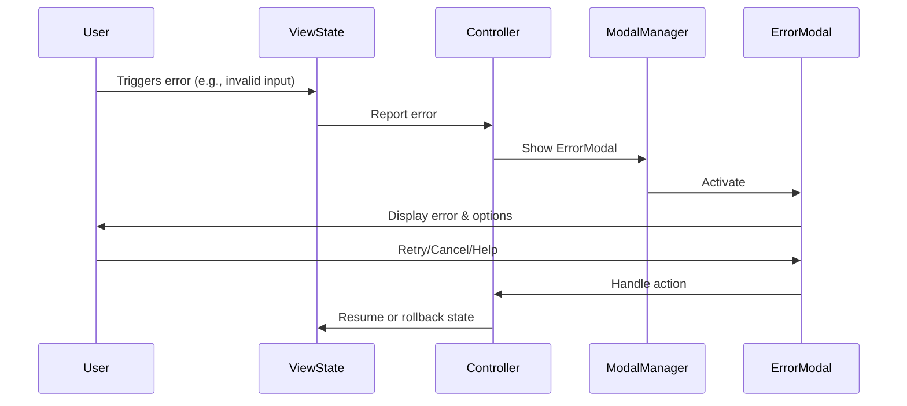

# Error Handling

## Observer/Command Patterns & Modular Error Handling
- All error types are defined in errors/domain.go; errors.go is deprecated and removed.
- Error handling uses observer and command patterns for modular, testable recovery flows.
- Error modals are created via factories and can observe error events for dynamic updates.

## Code Example: Error Modal Factory
```go
// src/components/modals/error_modal.go#L1-50
func NewErrorModalFactory(message string, onConfirm func()) *ErrorModal { ... }
```

## Code Example: Observer Error Modal
```go
// src/components/modals/error_modal.go#L51-70
type ErrorModal struct { ... }
func (m *ErrorModal) Notify(event interface{}) { ... }
```

## Technical Diagram


## Cross-References
- [modals.md](./modals.md#modal-types)
- [design.md](../design.md#error-handling)
- [structure.md](./structure.md#errors)
- [chatview.md](./chatview.md#focus--event-handling) 