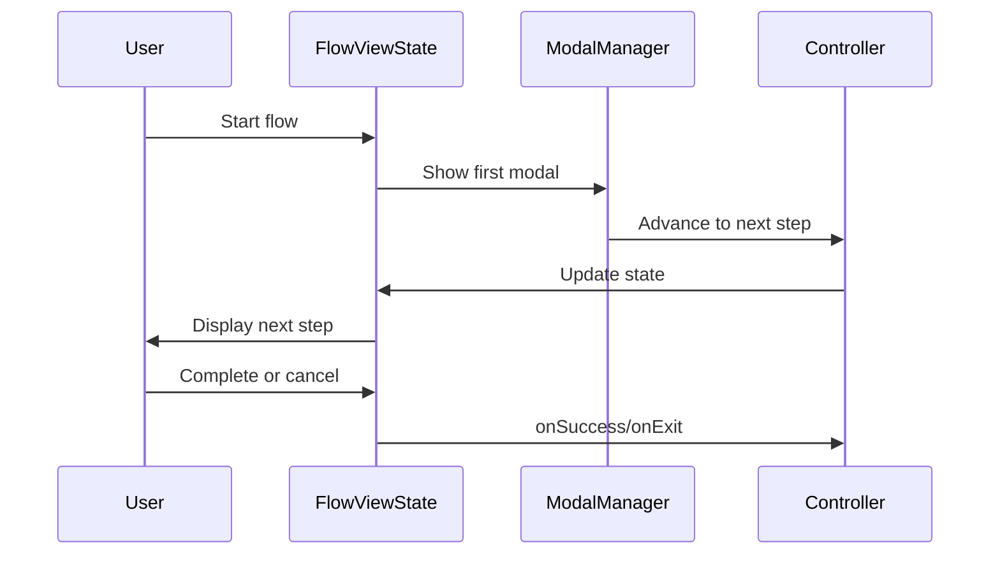

# Flows

## Update Instructions
- This file is the canonical reference for all multi-step flows in the application (e.g., chat creation, API key setup).
- When updating, review all flow-related code in `/src/views/flow/`, `/src/components/flows/`, and related modal logic.
- For each flow, outline the sequence of steps, state management, and handlers.
- Cross-reference with `modals.md`, `todo.md`, and other documentation.
- Keep this file in sync with new flows and changes to flow orchestration.

---

## Table of Contents
1. [Overview](#overview)
2. [Flow Definitions](#flow-definitions)
3. [State Management](#state-management)
4. [Handlers & Transitions](#handlers--transitions)
5. [Extensibility](#extensibility)
6. [Technical Diagram](#technical-diagram)
7. [Code Examples](#code-examples)
8. [References](#references)

---

## Overview

Flows are implemented as sequences of modal `ViewState` steps, each with its own state and handlers. They enable wizard-style, multi-step user interactions. Each flow is modular, testable, and can be extended with new steps or logic. See [modals.md](./modals.md#modal-flows) and [design.md](../design.md#modal--flow-system) for context.

---

## Flow Definitions

| Flow                | Steps                                      | File(s)                        |
|---------------------|--------------------------------------------|--------------------------------|
| Chat Creation       | Name → Model → Confirm                     | `components/flows/chat_creation.go` |
| API Key Setup       | Input → Test → Save                        | `components/flows/api_key_test.go`  |
| ...                 | ...                                        | ...                            |

**Example:**
```go
// src/components/flows/chat_creation.go#L1-50
func NewChatCreationFlow(ctx Context, nav Controller) ViewState { ... }
// src/components/flows/api_key_test.go#L1-50
func NewAPIKeyTestFlow(ctx Context, nav Controller) ViewState { ... }
```

---

## State Management

- **Immutable state**: Each flow maintains its own state, passed between steps and never mutated directly.
- **Navigation integration**: State is updated only via navigation/controller actions.
- **Persistence**: Flow state is serializable for persistence and restoration.

---

## Handlers & Transitions

- **Handlers**: `onExit`, `onSuccess` for flow completion or cancellation.
- **Navigation**: Controller manages advancing steps and returning to parent state.
- **Retry/cancel**: Flows can be cancelled or retried at any step.

---

## Extensibility

- **Adding flows**: Define new modal sequences and state logic.
- **Reusability**: Each step is a ViewState, enabling easy testing and extension.
- **Testability**: Flows are modular and can be tested independently.

---

## Factory Pattern & Observer/Command Integration
- All flows are sequences of modal ViewStates instantiated via factories.
- Each flow step can act as an observer and/or command for modular, testable transitions.

## Code Example: Flow Factory
```go
// src/components/flows/chat_creation.go#L1-50
func NewChatCreationFlowFactory(ctx Context, nav Controller) ViewState { ... }
```

## Code Example: Observer in Flow Step
```go
// src/views/flow.go#L63-105
type FlowViewState struct { ... }
func (f *FlowViewState) Notify(event interface{}) { ... }
```

## Technical Diagram


## Cross-References
- [modals.md](./modals.md#modal-flows)
- [todo.md](./todo.md#modalprompt-features)
- [design.md](../design.md#modal--flow-system)
- [structure.md](./structure.md#components) 