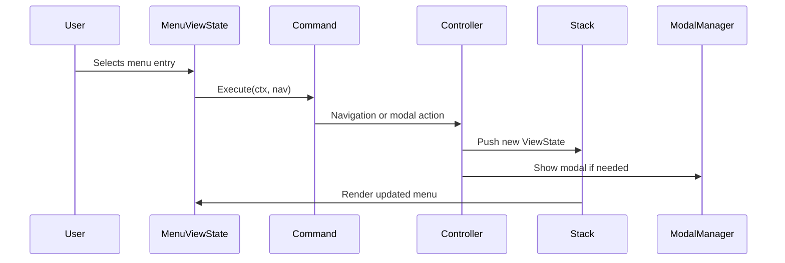

# Menu System

## Update Instructions
- This file is the canonical reference for the menu system, including menu entry definitions, dynamic menus, and action patterns.
- When updating, review all menu-related code in `/src/types/menu.go`, `/src/types/menuentryset.go`, and `/src/components/menus/`.
- For each menu, describe its structure, logic, and relationships.
- Cross-reference with `structure.md`, `design.md`, and other documentation.
- Keep this file in sync with new menus, menu actions, and changes to menu logic.

---

## Table of Contents
1. [Overview](#overview)
2. [Menu System Design](#menu-system-design)
3. [Menu Entry Definitions](#menu-entry-definitions)
4. [Dynamic Menus](#dynamic-menus)
5. [Action Patterns](#action-patterns)
6. [Technical Diagram](#technical-diagram)
7. [Code Examples](#code-examples)
8. [References](#references)

---

## Overview

Menus are defined as data, not hardcoded logic, and support dynamic, context-aware logic. All menu and submenu definitions are centralized and type-safe. The menu system is extensible, supporting nested and context-sensitive menus. See [structure.md](./structure.md#components) and [design.md](../design.md#menu-system) for context.

---

## Menu System Design

- **Centralized definitions**: All menus are defined in `types/menu.go` and `types/menuentryset.go` as data structures.
- **MenuEntry**: Each entry has text, description, action, next, and shortcut fields.
- **Menu actions**: Use context/controller for navigation and modal launches.
- **Rendering**: Menus are rendered using reusable components in `views/menu/`.
- **Stack-based navigation**: Menus are managed as ViewStates on the navigation stack.
- **Description display**: **Only main menu entries display descriptions; submenu entries show only the entry text.**

---

## Menu Entry Definitions

| Menu   | Entries                                      | File(s)                        |
|--------|----------------------------------------------|--------------------------------|
| Main   | Chats, Favorites, Prompts, Models, API Keys, Help, Exit | `types/menuentryset.go`        |
| ...    | ...                                          | ...                            |

**Example:**
```go
// src/types/menuentryset.go#L1-20
type MenuEntrySet []MenuEntry

var MainMenuEntries MenuEntrySet = []MenuEntry{
    {Text: "Chats", Action: ...},
    {Text: "Favorites", Action: ...},
    // ...
}
```

---

## Dynamic Menus

- **Runtime generation**: Menus can be generated or modified at runtime based on context.
- **Nested submenus**: Supports deeply nested submenus and context-aware logic.
- **ViewState management**: Menu state is managed as a ViewState for consistency and stack navigation.

---

## Action Patterns

- **Command pattern**: All actions use context/controller for navigation and modal launches.
- **Decoupling**: Menu actions are decoupled from UI logic for testability.
- **Type safety**: All actions are strongly typed and validated.

---

## Factory Pattern & Command Integration
- All menus are instantiated via factory functions for consistency and dependency injection.
- Menu actions use the Command pattern for modular, testable navigation and modal launches.
- Menus can act as observers for context-aware updates.

## Code Example: Menu Factory
```go
// src/types/view_state.go#L33-75
menu := types.NewMenuViewState(types.MainMenu, entries, "Main Menu", ctx, nav)
```

## Code Example: Command Pattern in Menu Action
```go
// src/types/menuentryset.go#L1-290
entry := mvs.entries[mvs.cursor]
if entry.Action != nil {
    cmd := entry.Action
    cmd.Execute(ctx, nav)
}
```

## Technical Diagram


---

## Code Examples

### 1. MenuViewState Implementation
```go
// src/types/view_state.go#L33-75
func NewMenuViewState(menuType MenuType, entries MenuEntrySet, title string, ctx Context, nav Controller) *MenuViewState { ... }
func (mvs *MenuViewState) UpdateWithContext(msg tea.Msg, ctx Context, nav Controller) (tea.Model, tea.Cmd) { ... }
```

### 2. Conditional Description Rendering
```go
// src/views/menu/box.go#L41-51
for i, option := range entries {
    line := option.Text
    // Only show description for main menu
    if menuView.IsMainMenu() && option.Description != "" {
        line += " - " + option.Description
    }
    // ... styling logic ...
}
```

### 3. Menu Entry Action
```go
// src/types/menuentryset.go#L1-290
entry := mvs.entries[mvs.cursor]
if entry.Action != nil {
    if err := entry.Action(ctx, nav); err != nil {
        nav.ShowModal("error", err.Error())
    }
}
```

### 3. Dynamic Menu Generation
```go
// src/types/menuentryset.go#L155-184
func getMenuEntries(menuType MenuType) MenuEntrySet {
    switch menuType {
    case MainMenu:
        return MainMenuEntries
    // ...
    }
}
```

---

## References
- [structure.md](./structure.md#components)
- [design.md](../design.md#menu-system)
- [modals.md](./modals.md#modal-types)
- [types.md](./types.md#core-interfaces) 