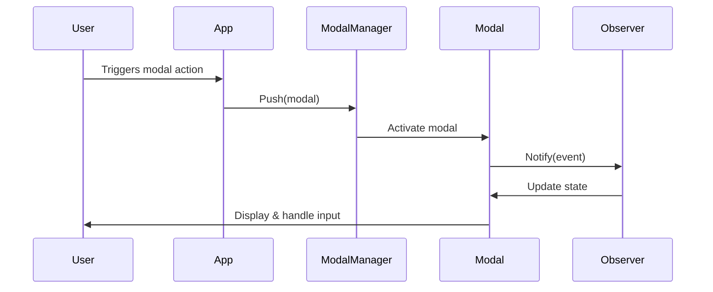

# Modals

## Update Instructions
- This file documents all modal types, modal flows, and modal management patterns.
- When updating, examine `/src/components/modals/`, `/src/views/flow/`, and related types in `/src/types/`.
- For each modal, describe its purpose, structure, and usage.
- Cross-reference with `flows.md` and `chatview.md`.
- Keep this file in sync with new modal types and flows.

---

## Table of Contents
1. [Overview](#overview)
2. [Modal Types](#modal-types)
3. [Modal Flows](#modal-flows)
4. [Modal Management](#modal-management)
5. [Extensibility](#extensibility)
6. [Technical Diagram](#technical-diagram)
7. [Code Examples](#code-examples)
8. [References](#references)

---

## Overview

The modal system supports confirmation, input, notice, error, selection, help, about, editor, and custom modals. All modals implement the Modal interface and ViewState. For system-wide context, see [design.md](../design.md#modal--flow-system) and [structure.md](./structure.md#components).

---

## Modal Types

| Type           | Purpose                        | File(s)                                 |
|----------------|--------------------------------|-----------------------------------------|
| Confirmation   | User confirmation dialogs      | `dialogs/confirmation.go`               |
| Input          | User input collection          | `dialogs/list_modal.go`, `editor.go`    |
| Error          | Error display and recovery     | `error_modal.go`                        |
| Help           | Help and about dialogs         | `dialogs/help.go`                       |
| Selection      | List selection                 | `dialogs/list_modal.go`                 |
| Editor         | Multi-line text editor modal   | `editor.go`                             |
| Custom         | Future extensibility           | ...                                     |

All modals are extensible: add new modal types by defining new structs and logic. Each modal should be decoupled, reusable, and implement the ViewState interface for navigation/controller compatibility.

**Example:**
```go
// src/components/modals/dialogs/confirmation.go#L1-50
func NewConfirmationModal(message string, options []string, onConfirm func(int)) *ConfirmationModal { ... }
func (m *ConfirmationModal) View() string { ... }
```

---

## Modal Flows

- **Multi-step flows**: (e.g., chat creation, API key setup) are implemented as sequences of modals.
- **Handlers**: Each step is a modal ViewState with state, onExit, and onSuccess handlers.
- **Reusability**: Flows are modular and reusable: handle both success and exit/escape cleanly.

**Example:**
```go
// src/views/flow.go#L63-105
func NewFlowViewState(...) *FlowViewState { ... }
```

---

## Modal Management

- **Centralized stack**: Centralized modal stack, decoupled from main view stack.
- **Manager**: Managed by modal manager (`manager.go`).
- **Controller integration**: Navigation controller manages modal stack, flow advancement, and return to parent state.

**Example:**
```go
// src/components/modals/manager.go#L1-50
func (m *ModalManager) Push(modal ViewState) { ... }
func (m *ModalManager) Pop() ViewState { ... }
```

---

## Extensibility

- **Adding modals**: Add new modal types by implementing the Modal interface and registering with the modal manager.
- **Adding flows**: Add new flows by defining new modal sequences and state logic.

---

## Factory Pattern & Observer Integration
- All modals are created via factory functions for consistency and dependency injection.
- Modals can act as observers, reacting to model state changes (e.g., error modals observing error events).

## Code Example: Modal Factory
```go
// src/components/modals/dialogs/confirmation.go#L1-50
func NewConfirmationModalFactory(message string, options []string, onConfirm func(int)) *ConfirmationModal { ... }
```

## Code Example: Observer Modal
```go
// src/components/modals/error_modal.go#L1-50
type ErrorModal struct { ... }
func (m *ErrorModal) Notify(event interface{}) { ... }
```

## Technical Diagram


## Cross-References
- [flows.md](./flows.md#modal-flows)
- [chatview.md](./chatview.md#composite-architecture)
- [design.md](../design.md#modal--flow-system)
- [structure.md](./structure.md#components) 