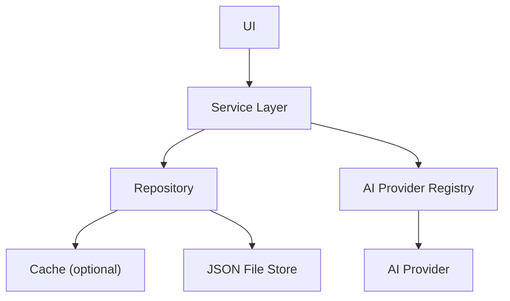
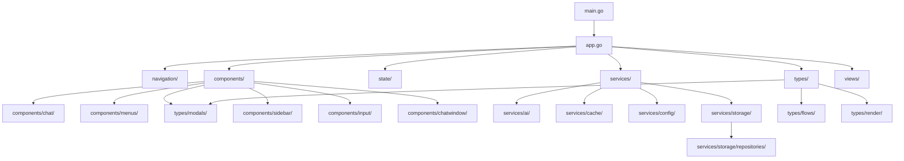

# Project Structure: src/

## Modular Organization & Patterns
- All UI regions, menus, and modals are instantiated via factory functions for consistency and dependency injection.
- Observer and Command patterns are used throughout models and UI for decoupled state updates and actions.
- Legacy files (e.g., errors.go, models.go) have been removed; see errors/domain.go and models/ for current logic.

## Code Example: Factory Usage
```go
// src/components/chat/composite.go#L132-226
chatView := chat.NewCompositeChatViewStateFactory(ctx, nav, ...)
```

## Code Example: Observer in Model
```go
// src/models/sidebar.go#L20-40
type SidebarTabsModel struct {
    observers []types.Observer
}
func (m *SidebarTabsModel) RegisterObserver(o types.Observer) { ... }
```

## Code Example: Command Pattern
```go
// src/models/input.go#L41-60
func (m *InputModel) ExecuteCommand(cmd types.Command, ctx types.Context, nav types.Controller) error {
    return cmd.Execute(ctx, nav)
}
```

## Data Access & Repository Structure
- All persistent data (chats, prompts, models, API keys) is accessed via repository patterns, typically located in `services/storage/repositories/`.
- Repositories abstract file I/O and JSON serialization, providing CRUD operations for each entity.
- Cached repositories (e.g., `CachedAPIKeyRepository`, `CachedModelRepository`, `CachedPromptRepository`) use the `services/cache/` package for in-memory caching and file modification detection.
- AI provider access is managed via the registry pattern in `services/ai/registry.go`, supporting dynamic loading and selection of providers (see also `services/ai/providers/`).
- Data access is modular and testable, supporting dependency injection and separation of concerns.

### Example: Chat Repository
```go
// src/services/storage/repositories/chats_repo.go#L1-82
repo := repositories.NewChatRepository()
allChats, err := repo.GetAll()
err = repo.Add(newChat)
```

### Example: Cached API Key Repository
```go
// src/services/storage/repositories/cached_keys_repo.go#L1-203
repo := repositories.NewCachedAPIKeyRepository()
keys, err := repo.GetAll()
err = repo.Add(newKey)
```

### Example: AI Provider Registry
```go
// src/services/ai/registry.go#L1-46
err := ai.LoadProvidersFromJSON("src/.config/providers.json")
providers := ai.GetAllProviders()
```

### Example: JSON Store
```go
// src/services/storage/json_store.go#L1-200
store := storage.NewJSONChatRepository("src/.config/chats/")
chats, err := store.GetAll()
```

### Example: Caching
```go
// src/services/cache/cache.go#L1-200
cache := cache.NewCache(100)
cache.Set("key", data, "src/.config/data.json")
val, ok := cache.Get("key", "src/.config/data.json")
```

### Data Access Diagram


## Technical Diagram


## Cross-References
- [design.md](../design.md)
- [chatview.md](./chatview.md)
- [modals.md](./modals.md)
- [menus.md](./menus.md)
- [types.md](./types.md) 