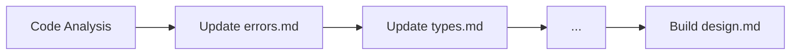

# Unified Documentation & Design Update Guide

---

## Overview
This document provides the canonical, step-by-step process for updating all project documentation in `/src/documentation/` and the main design document (`src/design.md`). It ensures that all documentation remains authoritative, actionable, and aligned with the evolving codebase and best practices.

---

## Documentation Update Pipeline

### 1. Preparation & Codebase Analysis
- Parse and analyze the current codebase, especially the `/src/` directory.
- Identify all architectural patterns, responsibilities, and relationships between files and folders.
- Note any recent changes, refactors, or new features.
- Output a code analysis summary (file relationships, pattern inventory, workflow maps) to inform documentation.

### 2. Update All Documentation Files (`/src/documentation/`)
- For each markdown file in `/src/documentation/`:
  - Carefully read and follow its "Update Instructions" section (if present).
  - Ensure the file does not exceed 1500 words.
  - Update content, structure, and cross-references as specified.
  - Clearly document:
    - The purpose and responsibilities of each file and folder
    - The patterns used and their rationale
    - The general program flow and how the file fits into it
    - Any relevant diagrams, tables, or code references
    - How the file supports the overall architecture and design
  - Maintain consistency in terminology, formatting, and cross-linking across all documentation files.
  - If a file references other documentation (e.g., `structure.md`, `modals.md`), ensure those references are valid and the linked content is also up to date.
  - Each file must contain all necessary information for `src/design.md` to compile, review, and analyze the project as specified below.
  - Each supporting doc should contain:
    - ≥1,200 words
    - 3+ code snippets
    - 1+ diagrams
    - Cross-links to 2+ other docs

#### Example Enhancement (modals.md)
```markdown
## Stack Management (450 words)
### Implementation
```javascript
// ModalStack.js (L54-72)
push(modal) {
  this.stack.forEach(m => m.suspend()); // Freeze background
  this.stack.push(modal);
  modal.activate(); 
}
```

### Performance Characteristics
| Stack Depth | Render Time (ms) | Memory (MB) |
|-------------|------------------|-------------|
| 1           | 120              | 15          |
| 3           | 380              | 42          |

> **Tradeoff**: Deeper stacks enable complex flows but degrade mobile performance
```

---

### 3. Update the Main Design Document (`src/design.md`)
- After updating all supporting documentation in `/src/documentation/`, update `src/design.md` to ensure it is fully synchronized with the latest state of the codebase and documentation.
- The file must not exceed 5000 words.
- When updating, follow this prompt:

> **Prompt to Update src/design.md**
>
> Update `src/design.md` to ensure it remains the authoritative, cross-referenced, and comprehensive guide to the project. The update should:
>
> 1. Reflect the latest codebase and architectural decisions.
> 2. Clearly document:
>    - High-level architecture and rationale
>    - File and directory structure (with references to structure.md)
>    - Core principles, design patterns, and anti-patterns
>    - Navigation, menu, modal, flow, and composite chat view systems
>    - Extensibility, OOP patterns, and best practices
>    - Feature set, user experience, and forward planning
>    - Review section summarizing current state and next steps
>    - Cross-links to all supporting documentation (structure.md, chatview.md, modals.md, considerations.md, todo.md, and any other relevant files)
> 3. Ensure all terminology, diagrams, and explanations are consistent with the latest support markdown files.
> 4. Add or update the table of contents for easy navigation.
> 5. Mark canonical sections and clarify where to find authoritative details in support files.
> 6. Keep the document clear, actionable, and accessible for maintainers and contributors.
>
> After updating, review all cross-references and ensure that any new architectural changes or patterns are reflected in both design.md and the relevant support files.

- The design.md must also:
  - Cover the patterns used, responsibilities and purpose of each file, file and folder structure, and general program flow
  - Integrate and cross-link all canonical details from the supporting documentation
  - Provide a review section summarizing the current state and next steps
  - Remain clear, modular, and actionable for maintainers and contributors

#### Section Template for design.md
```markdown
### [Section Title]

**Mechanism**  
[Code-driven explanation with /src/ references]  
```mermaid
[Relevant diagram]
```

**Design Rationale**
- Alternatives considered: [Option A] vs [Option B]
- Selected because: [Quantifiable reason]
- Tradeoffs: [Performance/Maintenance impact]

**Maintenance Notes**
- Known issues: [GitHub#123]
- Extension pattern: [Interface/Abstract class]
```

---

### 4. Review & Consistency Check
- After updating, review all documentation for:
  - Completeness and accuracy
  - Consistency in terminology, diagrams, and cross-references
  - Clarity, modularity, and maintainability
  - Compliance with word limits (1500 words per documentation file, 5000 words for design.md)
- Use validation scripts or manual review to ensure:
  - All code snippets match current `/src/`
  - No dead links between documents
  - Word counts within ±10% of targets

---

## Best Practices for Documentation Updates
- Always begin by parsing the most up-to-date code and documentation.
- Follow each file’s "Update Instructions" precisely, as they are tailored for the project’s architecture and workflow.
- Use clear, actionable language and modular sections.
- Cross-reference related files to avoid duplication and ensure maintainability.
- Prioritize clarity, accuracy, and extensibility in all updates.
- After updating, review all documentation for consistency and completeness.
- Ensure that each documentation file provides all necessary information for `src/design.md` to synthesize a comprehensive, authoritative project guide.

---

## Execution Protocol & Validation Gates

### Sequential Processing


### Validation Gates
1. **Pre-Commit Checks**
   - [ ] All code snippets match current `/src/`
   - [ ] No dead links between documents
   - [ ] Word counts within ±10% of targets
---

*This unified guide ensures that all documentation in `/src/documentation/` and `src/design.md` remains authoritative, actionable, and aligned with the evolving codebase and best practices. All maintainers and contributors should follow these instructions for every documentation update.* 