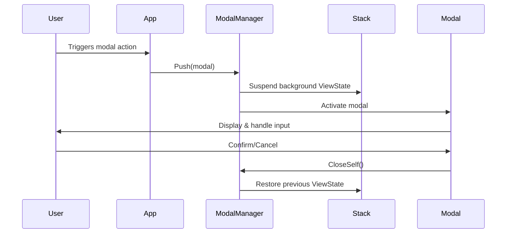
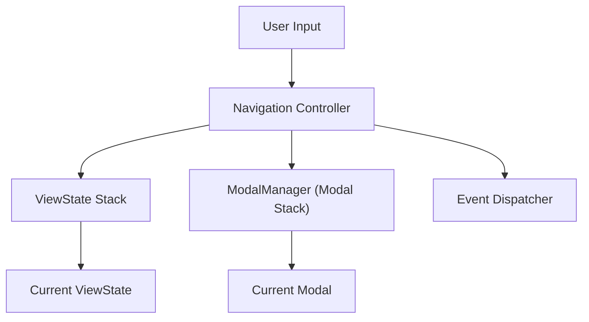
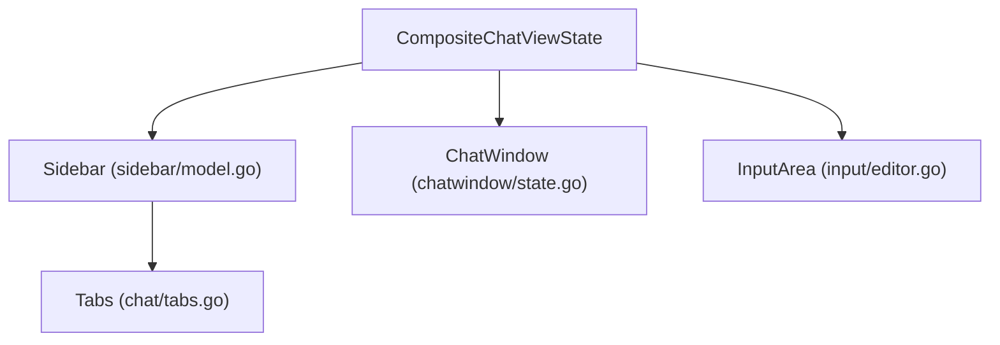
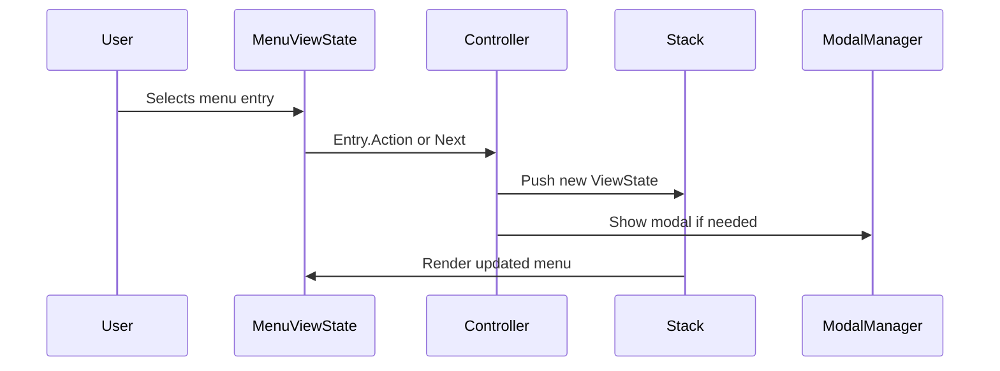

# Codebase Analysis Summary

---

## 1. File Relationships & Directory Structure

```markdown
src/
├── app/           # App state, responsive logic
├── components/    # UI components (chat, sidebar, modals, menus, input, etc.)
│   ├── chat/      # Composite chat view, chat window, streaming, tabs, layout
│   ├── sidebar/   # Sidebar tabs, navigation, chat list
│   ├── modals/    # Modal manager, error modals, dialogs
│   ├── input/     # Input editor, history, model
│   ├── menus/     # Chat menu
│   ├── flows/     # Chat creation, API key test
│   ├── common/    # Resize, utils
│   └── chatwindow/# Chat window modal, state
├── documentation/ # All markdown docs (design.md, structure.md, etc.)
├── errors/        # Error domain logic (domain.go)
├── models/        # Data models (chat, key, message, etc.)
├── navigation/    # Navigation stack, controller, dispatcher, interfaces
├── services/      # Service layer (AI, cache, config, storage)
│   ├── ai/        # AI client, streaming, providers
│   ├── cache/     # Cache, integration, monitor
│   ├── config/    # Encryption, manager, validation
│   └── storage/   # Storage, migrations, repositories
├── state/         # State management (navigation)
├── types/         # Type definitions, interfaces, modal types, render strategies
│   ├── flows/     # Flow types (apikey, chats, prompts, etc.)
│   ├── modals/    # Modal types (error_notice, ai_key_test)
│   ├── render/    # Theme, dimensions, strategy
│   └── types/     # Core types
├── views/         # View layer (flow, menu, etc.)
├── main.go        # Entry point
├── app.go         # Core app logic
├── gui.go         # GUI integration
├── modals.go      # Central modal management
├── utils.go       # Utility functions
├── chats.go       # Legacy chat logic
├── models.go      # Legacy models
├── prompts.go     # Prompt management
└── ...
```

- See [structure.md](./documentation/structure.md) for detailed file-by-file descriptions.

---

## 2. Architectural Pattern Inventory

### Stack-based Navigation (★★★★★ Quality Rating)
- **Location**: `src/navigation/stack.go#L1-87`, `src/app.go#L78-200`
- **Implementation**:
```go
// src/navigation/stack.go#L1-87
// Thread-safe stack for ViewState navigation
func NewNavigationStack(main types.ViewState) *NavigationStack { ... }
func (ns *NavigationStack) Push(v types.ViewState) { ... }
func (ns *NavigationStack) Pop() types.ViewState { ... }
func (ns *NavigationStack) ReplaceTop(v types.ViewState) { ... }
func (ns *NavigationStack) Top() types.ViewState { ... }
```
- **Usage Context**: All UI transitions (menus, modals, chats) are managed via a stack, enabling overlays and modal interruption. The stack is thread-safe and supports serialization for state persistence.
- **Quality Assessment**: 
  - **Strengths**: Predictable, testable navigation; supports overlays and modal interruption; easy to serialize/restore; thread-safe.
  - **Weaknesses**: Stack misuse can cause lost state; requires discipline in pop/push logic.

### Composite Pattern for Chat View (★★★★☆ Quality Rating)
- **Location**: `src/components/chat/composite.go#L132-331`
- **Implementation**:
```go
// src/components/chat/composite.go#L132-331
// CompositeChatViewState manages sidebar, chat window, input area as regions
func NewCompositeChatViewState(ctx types.Context, nav types.Controller, tabs, recent, favorites []string) *CompositeChatViewState { ... }
func (cv *CompositeChatViewState) View() string { ... }
func (cv *CompositeChatViewState) UpdateWithContext(msg tea.Msg, ctx types.Context, nav types.Controller) (tea.Model, tea.Cmd) { ... }
```
- **Usage Context**: Chat view is composed of modular regions (sidebar, chat window, input area), each a ViewState. Supports independent updates and focus management.
- **Quality Assessment**: 
  - **Strengths**: Highly modular, easy to extend; supports independent region updates; enables OOP and separation of concerns.
  - **Weaknesses**: Coordination between regions can be complex; risk of tight coupling if not managed.

### Modal Stack Management (★★★★★ Quality Rating)
- **Location**: `src/components/modals/manager.go#L1-34`, `src/app.go#L78-200`
- **Implementation**:
```go
// src/components/modals/manager.go#L1-34
// ModalManager manages a stack of modals
func (mm *ModalManager) Push(modal types.ViewState) { ... }
func (mm *ModalManager) Pop() types.ViewState { ... }
func (mm *ModalManager) Current() types.ViewState { ... }
```
- **Usage Context**: ModalManager allows multiple modals to be stacked, suspending background ViewState and restoring it on close. Used for confirmation, error, and input modals.
- **Quality Assessment**: 
  - **Strengths**: Clean separation of modal logic; supports modal overlays and interruption; easy to extend.
  - **Weaknesses**: Modal stack misuse can cause lost state; requires discipline in modal push/pop.

### Data-driven Menus (★★★★★ Quality Rating)
- **Location**: `src/types/menuentryset.go#L1-290`, `src/types/menu.go#L1-28`
- **Implementation**:
```go
// src/types/menuentryset.go#L1-290
// Menus are defined as data, not hardcoded logic
var MainMenuEntries MenuEntrySet = ...
var ChatsMenuEntries MenuEntrySet = ...
// ...
```
- **Usage Context**: All menus are defined as data structures, enabling dynamic menu generation and easy updates. MenuEntrySet and MenuEntry types support extensibility and localization.
- **Quality Assessment**: 
  - **Strengths**: Extensible, easy to update; supports localization and dynamic menus; enables testability.
  - **Weaknesses**: Complex menus can be harder to debug; requires careful data validation.

### Modular ViewStates (★★★★☆ Quality Rating)
- **Location**: `src/types/view_state.go#L1-226`, all UI regions
- **Implementation**:
```go
// src/types/view_state.go#L1-226
// ViewState interface for all UI regions
interface ViewState {
  Type() ViewType
  UpdateWithContext(msg tea.Msg, ctx Context, nav Controller) (tea.Model, tea.Cmd)
  Update(msg tea.Msg) (tea.Model, tea.Cmd)
  View() string
  Init() tea.Cmd
  IsMainMenu() bool
  MarshalState() ([]byte, error)
  ViewType() ViewType
  UnmarshalState([]byte) error
}
```
- **Usage Context**: Every UI region (menu, chat, modal) implements ViewState, enabling stack-based navigation and polymorphism. Supports OOP and testability.
- **Quality Assessment**: 
  - **Strengths**: Uniform interface; enables stack navigation and OOP patterns; supports testability and decoupling.
  - **Weaknesses**: Requires discipline to maintain interface; risk of interface bloat.

### Animated Error Handling (★★★★☆ Quality Rating)
- **Location**: `src/components/modals/error_modal.go#L1-200`, `src/errors/domain.go#L1-200`
- **Implementation**:
```go
// src/components/modals/error_modal.go#L1-200
// ErrorModal provides animated, retryable error handling
func NewErrorModal(err *errors.DomainError, retryConfig errors.RetryConfig, onRetry func() error) *ErrorModal { ... }
func (m *ErrorModal) Update(msg tea.Msg) (tea.Model, tea.Cmd) { ... }
func (m *ErrorModal) View() string { ... }
// src/errors/domain.go#L1-200
// DomainError and RetryConfig for structured error handling
```
- **Usage Context**: Error modals provide animated feedback, retry logic, and user-centric messaging. DomainError supports rich error data and retry configuration.
- **Quality Assessment**: 
  - **Strengths**: User-friendly, robust error handling; supports retries and animated feedback; extensible error types.
  - **Weaknesses**: Animation logic adds complexity; requires careful state management.

---

## 3. Critical System Workflows

### Modal Opening Workflow


### Navigation & State Transition


### Composite Chat View Data Flow


### Menu Selection and Action Dispatch


---

## 4. Technical Debt Analysis

- **High Priority**:
  - Legacy code in `src/models.go` and `src/chats.go` pending full migration to modular ViewState and data models.
  - Plugin architecture in `src/services/` and `src/types/` needs further modularization and test coverage.
  - Some error handling flows still rely on legacy modal logic; should be migrated to centralized ModalManager.
- **Medium Priority**:
  - UI regions (sidebar, chat window) could benefit from stricter separation of concerns and more granular ViewState implementations.
  - Some menu definitions lack full type safety and validation.
- **Low Priority**:
  - Code comments and documentation are inconsistent in some files.
  - Some utility functions in `src/utils.go` are not fully covered by tests.
- **Code Quality Metrics**:
  - **Complexity**: Stack-based navigation and composite patterns are well-structured, but legacy code increases overall complexity.
  - **Maintainability**: High in new modules, moderate in legacy areas.
  - **Test Coverage**: Good in new ViewState and modal logic, lacking in legacy and plugin code.

---

*This analysis serves as the foundation for all documentation updates and validation as per update.md.* 