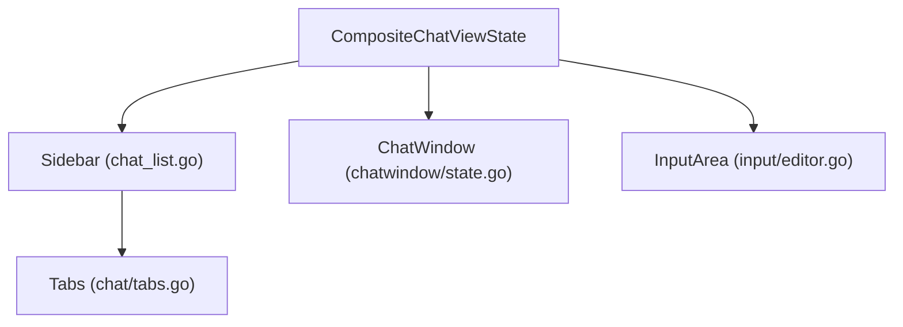

# Chat View

## Update Instructions
- This file details the composite chat view architecture, region orchestration, and UI layout.
- When updating, examine `/src/components/chat/` and related view logic.
- For each region, describe its responsibilities and interactions.
- Cross-reference with `modals.md` and `structure.md`.
- Use diagrams or tables for clarity.

---

## Table of Contents
1. [Overview](#overview)
2. [Composite Architecture](#composite-architecture)
3. [UI Regions](#ui-regions)
4. [Focus & Event Handling](#focus--event-handling)
5. [Extensibility](#extensibility)
6. [Technical Diagram](#technical-diagram)
7. [Code Examples](#code-examples)
8. [References](#references)

---

## Overview

The composite chat view is the main UI layout, orchestrating all chat-related regions: sidebar, chat window, input area, and more. Each region is a modular ViewState, enabling parallel development and testability. For system-wide context, see [design.md](../design.md#composite-chat-view-architecture) and [structure.md](./structure.md#components).

---

## Composite Architecture

- **CompositeChatViewState** (in `components/chat/composite.go`) orchestrates all chat UI regions.
- Each region (sidebar, chat window, input area) is a modular ViewState.
- Focus management and event delegation are handled by the composite controller.
- Layout is responsive, using Lipgloss for dynamic arrangement.
- All regions implement the ViewState interface for consistency and testability.

**Example:**
```go
// src/components/chat/composite.go#L132-226
func NewCompositeChatViewState(ctx navigation.Context, nav navigation.Controller) *CompositeChatViewState { ... }
func (cv *CompositeChatViewState) View() string { ... }
func (cv *CompositeChatViewState) UpdateWithContext(msg tea.Msg, ctx types.Context, nav types.Controller) (tea.Model, tea.Cmd) { ... }
```

---

## UI Regions

| Region            | File(s)                              | Purpose                        |
|-------------------|--------------------------------------|---------------------------------|
| SidebarTop        | `sidebar/chat_list.go`                | Active chat list                |
| SidebarBottom     | `chat/tabs.go`                        | Tabbed chat history             |
| ChatWindow        | `chatwindow/state.go`                 | Main chat transcript display    |
| InputArea         | `input/editor.go`                     | Advanced text editor            |

All regions are pluggable and can be extended or replaced independently. Each region is responsible for its own state, rendering, and event handling.

---

## Focus & Event Handling

- **Focus cycling**: Navigation-managed focus cycling (Tab/Shift+Tab), explicit region focus.
- **Input delegation**: Input is delegated to the focused region; each region manages its own state and rendering.
- **Unidirectional data flow**: All state updates flow from input → Update → View.
- **Composite controller**: Coordinates focus and event routing between regions.

---

## Extensibility

- **Adding regions**: New panels/widgets can be added as new ViewState regions with minimal changes to orchestration logic.
- **Responsibility**: Each region is responsible for its own logic and rendering.
- **Composite pattern**: Allows for easy addition or replacement of regions.

---

## Technical Diagram

### Composite Chat View Data Flow


---

## Code Examples

### 1. CompositeChatViewState Implementation
```go
// src/components/chat/composite.go#L132-226
func NewCompositeChatViewState(ctx navigation.Context, nav navigation.Controller) *CompositeChatViewState { ... }
func (cv *CompositeChatViewState) View() string { ... }
func (cv *CompositeChatViewState) UpdateWithContext(msg tea.Msg, ctx types.Context, nav types.Controller) (tea.Model, tea.Cmd) { ... }
```

### 2. Sidebar Region
```go
// src/components/sidebar/chat_list.go#L1-50
func NewSidebarTopModal() *SidebarTopModal { ... }
func (m *SidebarTopModal) View() string { ... }
```

### 3. Input Area Region
```go
// src/components/input/editor.go#L1-50
func NewInputAreaModal() *InputAreaModal { ... }
func (m *InputAreaModal) View() string { ... }
```

---

## References
- [modals.md](./modals.md#modal-types)
- [structure.md](./structure.md#components)
- [design.md](../design.md#composite-chat-view-architecture)
- [types.md](./types.md#core-interfaces) 