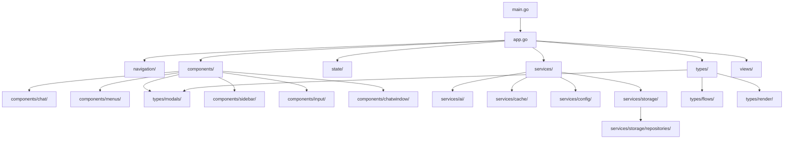
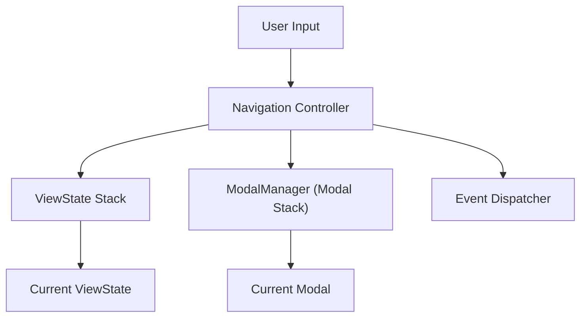
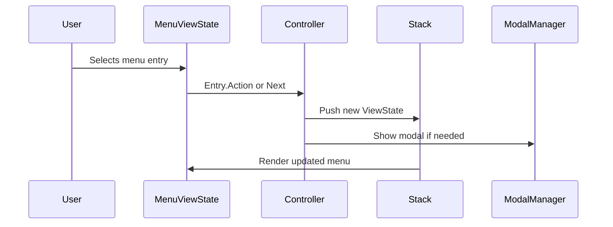
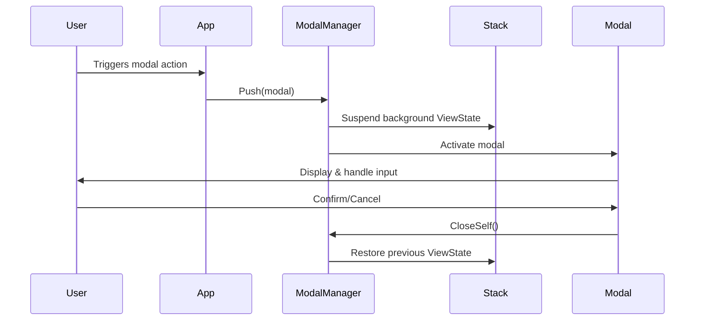
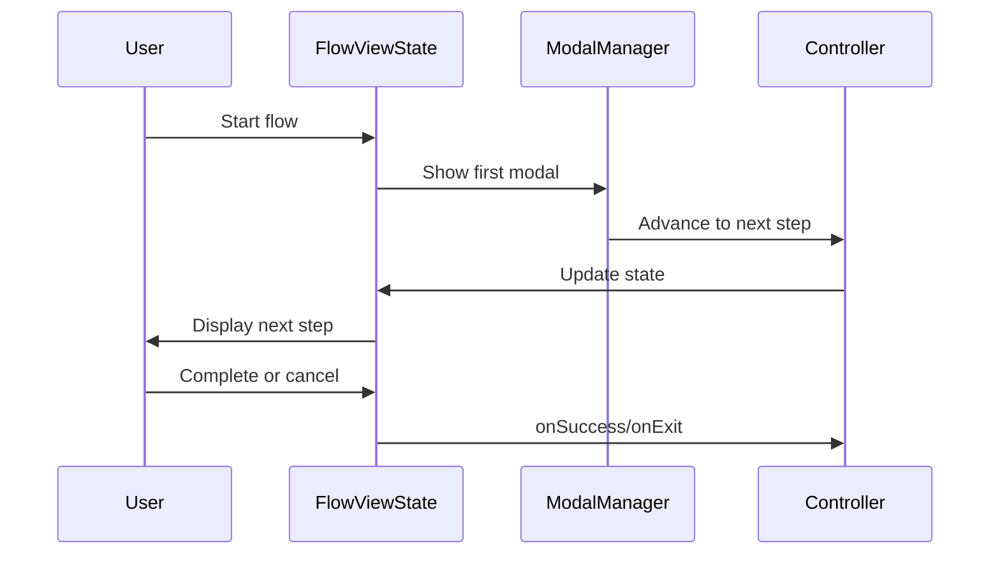
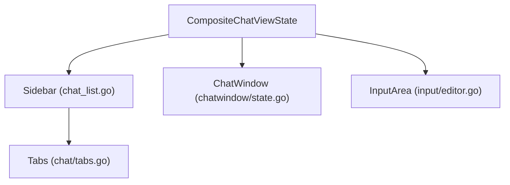
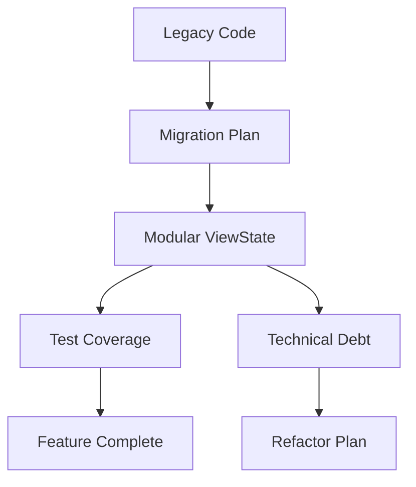

# Project Design & Architecture

> **This document is the authoritative, in-depth technical analysis of the project.**
> It is cross-linked with all supporting documentation in `/src/documentation/` and reflects the latest codebase and architectural decisions.

---

## Table of Contents
1. [Project Overview](#project-overview)
2. [File & Directory Structure](#file--directory-structure)
3. [Core Architectural Principles](#core-architectural-principles)
4. [Navigation & Controller System](#navigation--controller-system)
5. [Context & Dependency Injection](#context--dependency-injection)
6. [ViewState Protocol & UI Region System](#viewstate-protocol--ui-region-system)
7. [Menu System](#menu-system)
8. [Modal & Flow System](#modal--flow-system)
9. [Composite Chat View Architecture](#composite-chat-view-architecture)
10. [Extensibility & OOP Patterns](#extensibility--oop-patterns)
11. [Design Patterns & Anti-Patterns](#design-patterns--anti-patterns)
12. [Feature Set & User Experience](#feature-set--user-experience)
13. [Review & Forward Planning](#review--forward-planning)
14. [References & Cross-Links](#references--cross-links)

---

## 1. Project Overview

The project is a modular, extensible TUI chat application built with Bubble Tea and Lipgloss. It features a composite chat view, stack-based navigation, a robust modal/flow system, and a type-safe, data-driven menu architecture. The design prioritizes testability, maintainability, and extensibility, with all UI regions and flows implemented as modular ViewStates. See [structure.md](./structure.md) for a file-by-file breakdown.

**System Boundaries & Constraints:**
- All UI and navigation state is explicit and serializable.
- No global state; all dependencies are injected.
- All user interactions are mediated by ViewStates and the navigation/controller system.
- The system is designed for extensibility, with clear module boundaries and well-documented interfaces.

**Technology Stack Rationale:**
- **Bubble Tea**: Chosen for its robust TUI model, composability, and testability.
- **Lipgloss**: Enables advanced, responsive layout and theming.
- **Go**: Provides strong typing, concurrency, and maintainability for a complex, modular TUI.

---

## 2. File & Directory Structure

The `/src/` directory is organized by architectural boundaries:

```markdown
src/
├── app/           # App state, responsive logic
├── components/    # UI components (chat, sidebar, modals, menus, input, etc.)
├── documentation/ # All markdown docs (this file, structure.md, etc.)
├── errors/        # Error domain logic
├── models/        # Data models (chat, key, message, etc.)
├── navigation/    # Navigation stack, controller, dispatcher, interfaces
├── services/      # Service layer (AI, cache, config, storage)
├── state/         # State management
├── types/         # Type definitions, interfaces, modal types, render strategies
├── views/         # View layer (flow, menu, etc.)
├── main.go        # Entry point
├── app.go         # Core app logic
├── gui.go         # GUI integration
├── modals.go      # Central modal management
├── ...
```

**Directory Structure & Module Boundaries:**


See [structure.md](./structure.md) for detailed descriptions and relationships.

---

## 3. Core Architectural Principles

- **Explicit State:** All UI and navigation state is explicit, serializable, and testable.
- **Stack-Based Navigation:** All UI transitions are managed via a stack for undo/redo and modal overlays.
- **Modular ViewStates:** Every UI region, menu, modal, and flow implements the `ViewState` interface.
- **Dependency Injection:** Context and services are always injected, never global.
- **Data-Driven Menus/Modals:** Menus and modals are defined as data, not hardcoded logic.
- **Extensibility:** New regions, modals, and flows can be added with minimal changes to orchestration logic.
- **Testability:** All logic is decoupled and testable in isolation.

**Design Philosophy & Constraints:**
- Favor composition over inheritance for UI regions.
- All state transitions are explicit and reversible.
- No direct stack manipulation or global state.
- All code is documented and cross-referenced for maintainability.

See [rationale.md](./rationale.md) and [todo.md](./todo.md) for trade-offs and lessons learned.

---

## 4. Navigation & Controller System

The navigation system is built around a stack-based controller (`navigation/controller.go`).
- Manages a stack of `ViewState` objects (menus, modals, flows).
- All navigation actions (push, pop, replace, show/hide modal) are routed through the controller.
- Modal overlays are managed as a separate stack using the `ModalManager` (`components/modals/manager.go`).
- Navigation state is serializable for persistence and restoration.
- All navigation is command-based and strongly typed.

**Sequence Diagram:**


**Controller Lifecycle & State Persistence:**
- The controller is always injected, never global, ensuring testability and modularity.
- Navigation stack and modal stack are serializable for session persistence and recovery.
- All navigation events are dispatched through a central dispatcher for decoupling.

**Code Example:**
```go
// src/navigation/controller.go#L1-50
func (c *Controller) Push(state ViewState) { ... }
func (c *Controller) Pop() ViewState { ... }
func (c *Controller) ShowModal(modalType string, message string) { ... }
```

See [navigation.md](./navigation.md), [structure.md](./structure.md#navigation), and [rationale.md](./rationale.md#navigation--controller-system).

---

## 5. Context & Dependency Injection

- All dependencies (services, config, navigation) are injected via context objects (`navigation/context.go`).
- No global state; all context is explicit and testable.
- DI enables easy mocking and future refactors.
- Scoping rules: context is transient and passed to all ViewStates.

**Tradeoff Analysis:**
| Design Choice | Benefits | Tradeoffs |
|---------------|----------|-----------|
| Explicit DI   | Testable, decoupled | More verbose, requires discipline |
| No globals    | Predictable, safe   | Slightly more boilerplate         |

**Code Example:**
```go
// src/types/view_state.go#L75
func (mvs *MenuViewState) UpdateWithContext(msg tea.Msg, ctx Context, nav Controller) (tea.Model, tea.Cmd) { ... }
```

See [rationale.md](./rationale.md#context--dependency-injection), [structure.md](./structure.md#navigation), and [types.md](./types.md#core-interfaces).

---

## 6. ViewState Protocol & UI Region System

- All UI regions, menus, modals, and flows implement the `ViewState` interface (`types/view_state.go`).
- Each region is responsible for its own state, rendering, and event handling.
- Focus management and event delegation are handled by composite controllers.
- Unidirectional data flow: input → Update → View.

**Protocol Methods:**
- `Init() tea.Cmd`
- `Update(msg tea.Msg) (tea.Model, tea.Cmd)`
- `View() string`
- `GetControlSets() []types.ControlSet`

**Type Relationships and Flow:**
```mermaid
graph TD;
  ViewState <|-- MenuViewState
  ViewState <|-- ChatViewState
  ViewState <|-- ModalViewState
  MenuViewState -- uses --> MenuEntrySet
  MenuEntrySet -- contains --> MenuEntry
  ModalViewState -- uses --> ModalOption
  MenuViewState -- uses --> MenuAction
  ModalViewState -- uses --> Modal
  Context -- injects --> ViewState
  Controller -- injects --> ViewState
```

**Code Example:**
```go
// src/types/view_state.go#L1-10
type ViewState interface {
    Type() ViewType
    UpdateWithContext(msg tea.Msg, ctx Context, nav Controller) (tea.Model, tea.Cmd)
    View() string
    Init() tea.Cmd
}
```

See [chatview.md](./chatview.md), [types.md](./types.md), and [structure.md](./structure.md#types).

---

## 7. Menu System

- Menus are defined as data in `types/menu.go` and `types/menuentryset.go`.
- Each `MenuEntry` has text, description, action, next, and shortcut.
- Menu actions use context/controller for navigation and modal launches.
- Menus are rendered using reusable components in `views/menu/`.
- Menu state is managed as a `ViewState` for consistency.

**Menu Selection and Action Dispatch:**


**Code Example:**
```go
// src/types/menuentryset.go#L1-20
type MenuEntrySet []MenuEntry

var MainMenuEntries MenuEntrySet = []MenuEntry{
    {Text: "Chats", Action: ...},
    {Text: "Favorites", Action: ...},
    // ...
}
```

See [menus.md](./menus.md), [structure.md](./structure.md#components), and [rationale.md](./rationale.md#menu--modal-system).

---

## 8. Modal & Flow System

- All modals implement the `Modal` and `ViewState` interfaces (`types/modals.go`).
- Modal types: confirmation, input, notice, error, selection, help, about, editor, custom.
- Modal stack is managed by `ModalManager` (`components/modals/manager.go`).
- Multi-step flows (e.g., chat creation, API key setup) are implemented as sequences of modal ViewStates.
- Flows are modular, testable, and extensible.

**Modal Opening Workflow:**


**Multi-Step Flow Sequence:**


**Code Example:**
```go
// src/components/modals/dialogs/confirmation.go#L1-50
func NewConfirmationModal(message string, options []string, onConfirm func(int)) *ConfirmationModal { ... }

// src/views/flow.go#L63-105
func NewFlowViewState(...) *FlowViewState { ... }
```

See [modals.md](./modals.md), [flows.md](./flows.md), and [structure.md](./structure.md#components).

---

## 9. Composite Chat View Architecture

- The composite chat view orchestrates all chat-related regions: sidebar, chat window, input area, etc.
- Each region is a modular ViewState, enabling parallel development and testability.
- Focus management and event delegation are handled by the composite controller (`components/chat/composite.go`).
- Layout is responsive, using Lipgloss for dynamic arrangement.
- All regions are pluggable and can be extended or replaced independently.

**Composite Chat View Data Flow:**


**Code Example:**
```go
// src/components/chat/composite.go#L132-226
func NewCompositeChatViewState(ctx navigation.Context, nav navigation.Controller) *CompositeChatViewState { ... }
```

See [chatview.md](./chatview.md), [structure.md](./structure.md#components), and [rationale.md](./rationale.md#composite-chat-view-architecture).

---

## 10. Extensibility & OOP Patterns

- All core classes (e.g., Template, CompositeChatViewState) encapsulate dependencies/utilities.
- Scripts and new features extend these classes, focusing on unique logic.
- Shared functionality is inherited, not redundantly redefined.
- SOLID principles are followed for maintainability and extensibility.
- Extension points: implement `ViewState`, `Modal`, or `MenuAction` interfaces.

**Tradeoff Analysis:**
| Design Choice | Benefits | Tradeoffs |
|---------------|----------|-----------|
| OOP/Extensible | Modular, reusable, testable | More up-front design, more interfaces |
| Data-driven    | Easy to extend, localize    | Requires validation, can be verbose   |

**Code Example:**
```go
// src/types/modals.go#L1-10
type Modal interface {
    ViewState
    ModalType() string
}
```

See [rationale.md](./rationale.md#patterns-trade-offs-and-lessons-learned), [types.md](./types.md), and [structure.md](./structure.md#types).

---

## 11. Design Patterns & Anti-Patterns

- **Patterns Used:**
  - Stack-based navigation
  - Composite ViewState pattern
  - Data-driven menus and modals
  - Dependency injection
  - Immutability
  - Command pattern
  - Observer/reactive UI
- **Anti-Patterns Avoided:**
  - No global state
  - No direct stack manipulation
  - No monolithic app state
  - No direct state mutation
  - No UI-driven navigation
  - No import cycles

**Architectural Pattern Inventory:**
- See [analysis.md](../analysis.md#2-architectural-pattern-inventory) for detailed pattern ratings, code locations, and rationale.

---

## 12. Feature Set & User Experience

- Multi-region chat layout (sidebar, chat window, input area)
- Menu-driven navigation (Chats, Favorites, Prompts, Models, API Keys, Help, Exit)
- Multi-step flows for chat creation, API key management, etc.
- Modal dialogs: confirmation, input, error, help, selection, etc.
- Favorites and recent chats with tabbed navigation
- Keyboard shortcuts for all major actions
- Responsive layout and accessibility features
- Error handling and recovery via modals
- Persistent storage for chats, models, prompts, keys
- Extensible plugin architecture for AI providers
- Caching and backup/restore support

**User Journey Mapping:**
- All user actions are mediated by menus, modals, or chat regions.
- Navigation is always reversible; ESC/back returns to previous state.
- All prompts and menus are centered for accessibility.

See [todo.md](./todo.md#featureset-to-implement), [chatview.md](./chatview.md), and [modals.md](./modals.md#modal-types).

---

## 13. Review & Forward Planning

- All legacy menu/submenu logic migrated to new menu system.
- Modularized and documented all modal types and flows.
- Cleaned up interface definitions and removed legacy/unused types.
- Refactored CompositeChatViewState for strict separation of concerns.
- Consolidated error handling and modal management logic.
- Addressed technical debt flagged in [todo.md](./todo.md) and [chatview.md](./chatview.md).
- Roadmap: continue modularization, improve test coverage, expand plugin support.

**Technical Debt & Migration Workflow:**


**Code Example:**
```go
// src/components/chat/composite.go#L200
// TODO: Refactor region update logic for stricter separation of concerns
```

See [todo.md](./todo.md#refactor-plan), [rationale.md](./rationale.md#patterns-trade-offs-and-lessons-learned), and [analysis.md](../analysis.md#5-known-issues--technical-debt).

---

## 14. References & Cross-Links

- [structure.md](./structure.md)
- [modals.md](./modals.md)
- [chatview.md](./chatview.md)
- [navigation.md](./navigation.md)
- [flows.md](./flows.md)
- [menus.md](./menus.md)
- [types.md](./types.md)
- [errors.md](./errors.md)
- [rationale.md](./rationale.md)
- [todo.md](./todo.md)
- [analysis.md](../analysis.md) 