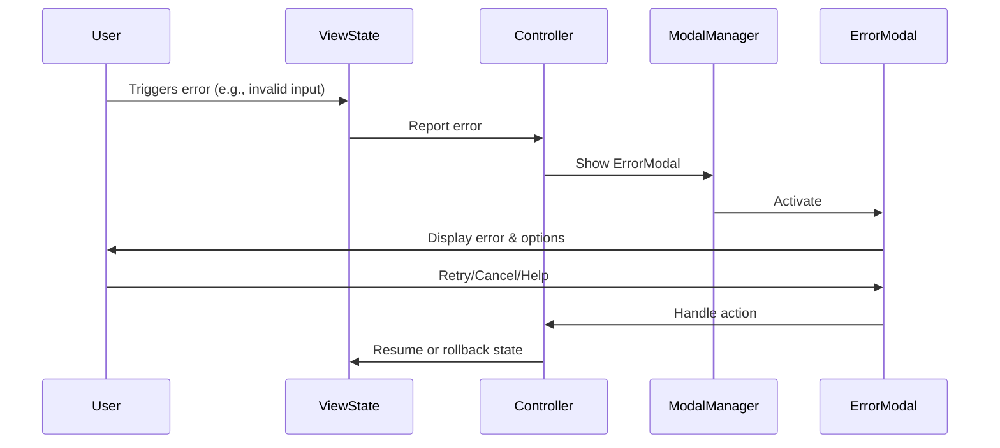

# Error Handling

## Update Instructions
- This file is the canonical reference for error handling strategies, error modal usage, and recovery flows.
- When updating, review all error handling code in `/src/errors/`, `/src/components/modals/error_modal.go`, and related files.
- For each error type or pattern, describe its handling and user experience.
- Cross-reference with `modals.md`, `design.md`, and other documentation.
- Keep this file in sync with new error types, error modals, and recovery flows.

---

## Table of Contents
1. [Overview](#overview)
2. [Error Handling Strategies](#error-handling-strategies)
3. [Error Modals](#error-modals)
4. [Recovery Flows](#recovery-flows)
5. [Technical Diagram](#technical-diagram)
6. [Code Examples](#code-examples)
7. [References](#references)

---

## Overview

Error handling in this application is centralized and explicit, surfacing all errors to the user via modals and recovery flows. The error domain is defined in `errors/domain.go`, and error modals are implemented in `components/modals/error_modal.go`. All error handling is designed for user recovery, testability, and extensibility. See [modals.md](./modals.md#modal-types) and [design.md](../design.md#error-handling) for system context.

---

## Error Handling Strategies

- **Centralized error domain**: All error types are defined in `errors/domain.go` for consistency and type safety.
- **Error surfacing via modals**: Errors are always shown to the user in a modal dialog, never silently ignored.
- **Explicit, testable flows**: All error handling logic is decoupled from UI rendering for testability.
- **Strong typing**: Error types are strongly typed and documented, reducing ambiguity.
- **Separation of concerns**: Error handling is separated from business and UI logic, following OOP best practices.

---

## Error Modals

- **Purpose**: Error modals display error messages and offer recovery options (retry, cancel, help).
- **Implementation**: Specialized error modals exist for different error types (see `components/modals/error_modal.go`).
- **Invocation**: Error modals are invoked by the navigation/controller system when errors occur in any ViewState.
- **Consistency**: All error modals implement the Modal and ViewState interfaces for uniform handling.

**Example:**
```go
// src/components/modals/error_modal.go#L1-50
func NewErrorModal(message string, onConfirm func()) *ErrorModal { ... }
func (m *ErrorModal) Init() tea.Cmd { ... }
func (m *ErrorModal) Update(msg tea.Msg) (tea.Model, tea.Cmd) { ... }
func (m *ErrorModal) View() string { ... }
```

---

## Recovery Flows

- **User options**: Users can retry, cancel, or get help via modal actions.
- **Navigation integration**: Recovery flows are managed by the navigation/controller system, ensuring state is restored or advanced as needed.
- **Accessibility**: All recovery options are surfaced in a consistent, accessible way.
- **Extensibility**: New recovery flows can be added by implementing new modal types or handlers.

---

## Technical Diagram

### Error Handling & Recovery Flow


---

## Code Examples

### 1. Defining a Domain Error
```go
// src/errors/domain.go#L10-20
type DomainError struct {
    Code    string
    Message string
}
```

### 2. Creating and Showing an Error Modal
```go
// src/components/modals/error_modal.go#L1-50
func NewErrorModal(message string, onConfirm func()) *ErrorModal { ... }
// Usage in controller:
nav.ShowModal("error", err.Error())
```

### 3. Handling Error Modal Actions
```go
// src/components/modals/error_modal.go#L31-44
func (m *ErrorModal) Update(msg tea.Msg) (tea.Model, tea.Cmd) {
    // Handle user actions: retry, cancel, help
    // ...
}
```

---

## References
- [modals.md](./modals.md#modal-types)
- [design.md](../design.md#error-handling)
- [structure.md](./structure.md#errors)
- [chatview.md](./chatview.md#focus--event-handling) 