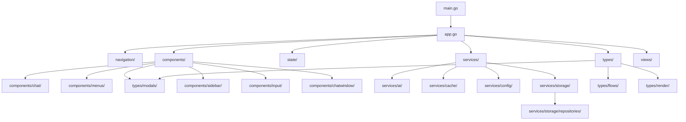

# Project Structure: src/

## Update Instructions
- This file is the canonical, up-to-date map of the `/src/` directory and all its subfolders and files.
- When updating, scan all files and folders in `/src/` and cross-reference with `design.md`, `considerations.md`, and other documentation.
- For each file and folder, summarize its purpose, key responsibilities, and relationships to other files.
- Use a directory tree, tables, and concise descriptions. Highlight architectural boundaries and dependencies.
- Keep this file in sync with codebase changes and all cross-referenced documentation.

---

**This document is the canonical file-by-file structure reference for the project.**
- For architectural rationale, see [design.md](../design.md).
- For composite chat view, see [chatview.md](./chatview.md).
- For modal/flow system, see [modals.md](./modals.md).
- For design patterns and decisions, see [considerations.md](./considerations.md).
- For current/planned features and migration, see [todo.md](./todo.md).

---

## Table of Contents
1. [Root Files](#root-files)
2. [Core Folders](#core-folders)
3. [Technical Diagram](#technical-diagram)
4. [Code Examples](#code-examples)
5. [Notes & Cross-References](#notes--cross-references)

---

## Root Files

- **main.go**: Application entry point. Initializes the app, sets up the main event loop, and launches the TUI. See [design.md](../design.md#file--directory-structure).
- **app.go**: Core application model and state management. Coordinates app-wide state, navigation, and high-level event handling.
- **gui.go**: GUI-specific logic and integration with Bubble Tea. Handles rendering, input, and main update loop for the TUI.
- **modals.go**: Central modal management. Registers, launches, and coordinates modal dialogs across the app.
- **errors.go**: Error handling utilities and error type definitions.
- **models.go**: Legacy and shared data models for chats, messages, and app state.
- **prompts.go**: Prompt management and utilities for chat interactions.
- **utils.go**: General-purpose utility functions used throughout the codebase.
- **chats.go**: Chat session management, including chat creation, loading, and persistence.

---

## Core Folders

### app/
- **app.go**: (see above)
- **responsive_app.go**: Responsive layout logic for the main app, adapting to terminal size changes.

### components/
- **chat/**: Composite chat view logic. Contains modular region implementations (sidebar, chat window, input area) and the `CompositeChatViewState` root controller. Handles message display, chat flows, and region composition. See [chatview.md](./chatview.md#composite-architecture).
  - **composite.go**: Main composite chat view controller. Orchestrates all chat UI regions.
  - **model.go**: Data models and state for chat regions.
  - **responsive_view.go**: Responsive layout logic for chat view.
  - **streaming.go**: Handles streaming chat responses.
  - **tabs.go**: Tabbed chat region logic (recent/favorites).
  - **view.go**: Rendering logic for chat regions.
- **chatwindow/**: Chat window region logic and modal overlays.
  - **modal.go**: Modal overlays for chat window (e.g., help, confirmation).
  - **state.go**: State management for chat window region.
- **common/**: Shared UI utilities (e.g., resizing, centering, reusable helpers).
  - **resize.go**: Responsive resizing utilities.
  - **utils.go**: Miscellaneous UI helpers.
- **input/**: Advanced text editor/input area logic.
  - **editor.go**: Multi-line text editor implementation.
  - **history.go**: Input history management.
  - **model.go**: State and data models for input area.
  - **view.go**: Rendering logic for input area.
- **menus/**: Menu and submenu modal logic.
  - **ChatMenu.go**: Main chat menu modal implementation.
- **modals/**: Modal dialog system (confirmation, help, input, etc.). See [modals.md](./modals.md#modal-types).
  - **base.go**: Base modal interface and shared logic.
  - **dialogs/**: Specific modal dialog implementations.
    - **confirmation.go**: Confirmation dialog modal.
    - **help.go**: Help modal dialog.
    - **list_modal.go**: List selection modal.
    - **menu.go**: Menu modal dialog.
  - **editor.go**: Modal for editing text.
  - **error_modal.go**: Error display modal.
  - **manager.go**: Modal manager for stacking and focus.
- **sidebar/**: Sidebar region logic (active chats, recent, favorites).
  - **chat_list.go**: Active chat list region.
  - **model.go**: Sidebar state and data models.
  - **navigation.go**: Sidebar navigation logic.
  - **responsive_sidebar.go**: Responsive layout for sidebar.
  - **view.go**: Sidebar rendering logic.

### errors/
- **domain.go**: Domain-specific error types and error handling logic.

### models/
- **chat.go**: Chat session data models.
- **errors.go**: Error models for chat and app state.
- **key.go**: API key management models.
- **message.go**: Message data models.
- **model.go**: General app data models.
- **prompt.go**: Prompt data models.

### navigation/
- **actions.go**: Navigation actions and event definitions.
- **context.go**: App context for dependency injection and state access. See [design.md](../design.md#context--dependency-injection).
- **controller.go**: Navigation controller implementation (stack, modal, focus management).
- **dispatcher.go**: Navigation event dispatcher and routing logic.
- **interfaces.go**: Navigation and context interface definitions.
- **stack.go**: Navigation stack data structure and operations.

### services/
- **ai/**: AI provider integration (OpenAI, etc.).
  - **client.go**: AI client logic.
  - **interface.go**: AI provider interface.
  - **providers/**: Specific provider implementations (e.g., openai.go).
  - **streaming.go**: Streaming response handling.
- **cache/**: Caching and memory management for app data.
  - **cache.go**: Cache logic.
  - **config.go**: Cache configuration.
  - **integration.go**: Cache integration points.
  - **monitor.go**: Cache monitoring and stats.
- **config/**: App configuration management.
  - **encryption.go**: Config encryption utilities.
  - **manager.go**: Config manager logic.
  - **validation.go**: Config validation.
- **storage/**: Persistent storage and repositories.
  - **backup.go**: Backup/restore logic.
  - **interface.go**: Storage interface definitions.
  - **json_storage.go**: JSON-based storage implementation.
  - **json_store.go**: JSON store logic.
  - **migrations.go**: Storage migrations.
  - **navigation.go**: Storage navigation helpers.
  - **repositories/**: Data repositories for chats, models, keys, etc.
  - **repository.go**: Base repository logic.

### state/
- **navigation.go**: App state and navigation state management.

### types/
- **interfaces.go**: Core interface definitions (ViewState, MenuActionContext, etc.).
- **menu.go**: Menu type definitions and constants.
- **menuentryset.go**: Menu entry sets and action definitions.
- **modals.go**: Modal type definitions and interfaces.
- **types/**: (subfolder for additional type definitions)
- **types.go**: General type definitions for app state, chat, etc.
- **view_state.go**: ViewState interface and region-specific view state types.

### views/
- **flow.go**: Flow modal system and flow-based view logic. See [modals.md](./modals.md#modal-flows).
- **menu/**: Menu rendering and layout logic.
  - **ascii_art.go**: ASCII art for menus.
  - **box.go**: Menu box rendering.
  - **control_info.go**: Control info/help rendering.
  - **render.go**: Menu rendering logic.

---

## Technical Diagram

### Directory Structure & Module Boundaries


---

## Code Examples

### 1. CompositeChatViewState
```go
// src/components/chat/composite.go#L132-226
func NewCompositeChatViewState(ctx navigation.Context, nav navigation.Controller) *CompositeChatViewState { ... }
```

### 2. Navigation Stack
```go
// src/navigation/stack.go#L14-81
func NewNavigationStack(main types.ViewState) *NavigationStack { ... }
func (ns *NavigationStack) Push(v types.ViewState) { ... }
func (ns *NavigationStack) Pop() types.ViewState { ... }
```

### 3. Modal Manager
```go
// src/components/modals/manager.go#L1-50
func (m *ModalManager) Push(modal ViewState) { ... }
func (m *ModalManager) Pop() ViewState { ... }
```

---

## Notes & Cross-References
- **CompositeChatViewState** (in `components/chat/composite.go`) is the root controller for the chat UI, orchestrating all modular regions and integrating with navigation and context. See [chatview.md](./chatview.md#composite-architecture).
- **Navigation system** (in `navigation/`) provides stack-based navigation, modal management, and context injection for all view states. See [design.md](../design.md#navigation--controller-system).
- **Types** (in `types/`) centralize all interface and type definitions for modularity and extensibility.
- **All UI regions** (sidebar, chat window, input area) are modular, reusable, and implement the `ViewState` interface for consistency and testability. See [design.md](../design.md#viewstate-protocol--ui-region-system).
- For modal/flow system details, see [modals.md](./modals.md#modal-types).
- For architectural rationale and patterns, see [considerations.md](./considerations.md).
- For current/planned features and migration, see [todo.md](./todo.md). 