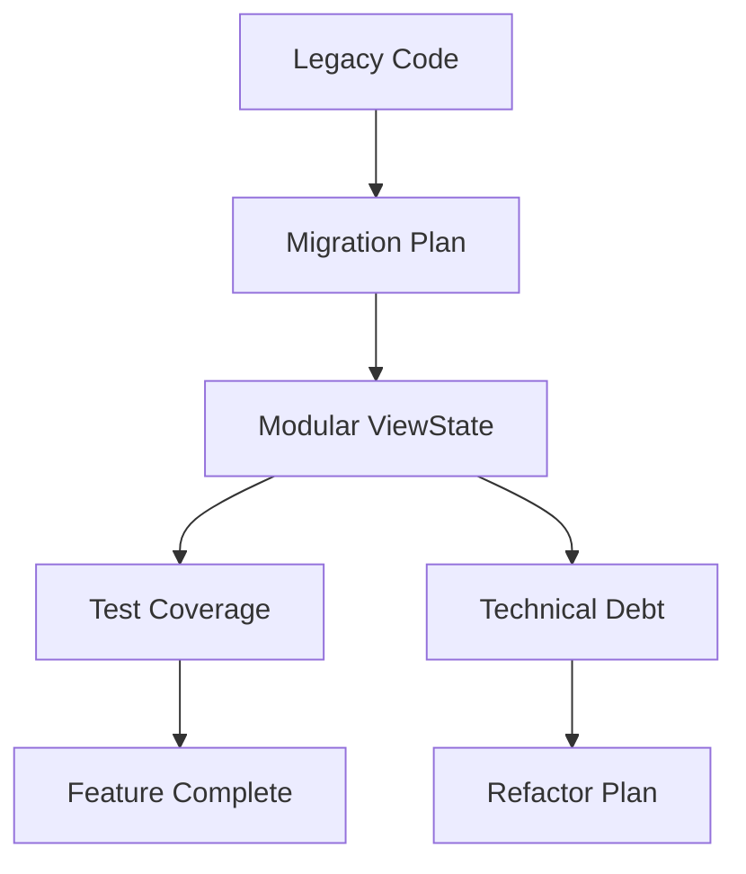

# Project TODOs, Planning, and Forward-Looking Considerations

## Update Instructions
- This file is the canonical reference for actionable TODOs, migration steps, technical debt, and forward-looking architectural considerations and trade-offs.
- When updating:
  - Review all code comments, `// TODO`, open issues, and recent changes in `/src/`.
  - For each actionable item, provide a description, priority, and references to relevant files or documentation.
  - For each consideration or trade-off, provide context, reasoning, and references to code or other docs.
  - Keep this file actionable, up-to-date, and cross-referenced with `design.md`, `structure.md`, and other documentation.
  - Use this file for things yet to be implemented or decided. For rationale behind already implemented choices, see [rationale.md](./rationale.md).
  - Ensure all cross-references are current and relative.
  - Do not exceed 1500 words.

---

## Table of Contents
1. [Progress & Steps](#progress--steps)
2. [Legacy Migration Plan](#legacy-migration-plan)
3. [Featureset to Implement](#featureset-to-implement)
4. [Legacy Menu Structure](#legacy-menu-structure)
5. [Modal/Prompt Features](#modalprompt-features)
6. [Navigation & Behavior](#navigation--behavior)
7. [Refactor Plan](#refactor-plan)
8. [Forward-Looking Considerations & Trade-offs](#forward-looking-considerations--trade-offs)
9. [Anti-Patterns to Avoid](#anti-patterns-to-avoid)
10. [Technical Diagram](#technical-diagram)
11. [Code Examples](#code-examples)
12. [Cross-References](#cross-references)

---

## Progress & Steps
Tracks major steps in refactoring, migration, and feature implementation. For architectural context, see [design.md](../design.md#review--forward-planning).

---

## Legacy Migration Plan
- Extract legacy menu logic and document all menu options, actions, and transitions.
- Design new menu components as modular, reusable modals.
- Integrate main menu modal at app startup.
- Route all navigation between menus/submenus through the modal manager and update app state accordingly.
- Encapsulate all menu logic for reusability and extensibility.

For more, see [design.md](../design.md#review--forward-planning) and [structure.md](./structure.md#components).

---

## Featureset to Implement
- Multi-region chat layout (sidebar, chat window, input area)
- Menu-driven navigation (Chats, Favorites, Prompts, Models, API Keys, Help, Exit)
- Multi-step flows for chat creation, API key management, etc.
- Modal dialogs: confirmation, input, error, help, selection, etc.
- Favorites and recent chats with tabbed navigation
- Keyboard shortcuts for all major actions
- Responsive layout and accessibility features
- Error handling and recovery via modals
- Persistent storage for chats, models, prompts, keys
- Extensible plugin architecture for AI providers
- Caching and backup/restore support

For more, see [design.md](../design.md#feature-set--user-experience).

---

## Legacy Menu Structure
See [design.md](../design.md#menu-system) and [structure.md](./structure.md#components) for canonical menu and submenu structure.

---

## Modal/Prompt Features
- Confirmation modals for actions like exit, delete, etc.
- Information modals for help/about, error messages, etc.
- Text input modals for entering chat names, prompts, model names, etc.
- Selection modals for choosing from lists (chats, models, prompts, API keys).

For more, see [modals.md](./modals.md#modal-types).

---

## Navigation & Behavior
- Keyboard navigation: Up/Down arrows (or j/k), Enter to select, Esc/q/Ctrl+Q to go back or quit.
- Menus and prompts are always centered.
- ESC/back always returns to the previous menu, not quitting the app unless at the main menu.
- All submenus and modals are managed by a modal manager for stack-based navigation.

For more, see [chatview.md](./chatview.md#focus--event-handling) and [design.md](../design.md#navigation--controller-system).

---

## Refactor Plan
- Finalize migration of all legacy menu/submenu logic to new menu system.
- Modularize and document all modal types and flows.
- Clean up interface definitions and remove legacy/unused types.
- Refactor CompositeChatViewState for even stricter separation of concerns.
- Consolidate error handling and modal management logic.
- Address any technical debt flagged in this file and in [chatview.md](./chatview.md).

For more, see [design.md](../design.md#review--forward-planning).

---

## Forward-Looking Considerations & Trade-offs
- Chose explicit state over global variables for testability and maintainability.
- Stack-based navigation for undo/redo at the cost of some complexity.
- Centralized controller/service for navigation, but always injected for testability.
- Modular UI regions for extensibility, requiring more interface definitions.
- Data-driven menus for extensibility and testability.
- Explicit dependency injection for testability and decoupling.

---

## Anti-Patterns to Avoid
- No global state
- No direct stack manipulation
- No monolithic app state
- No direct state mutation
- No UI-driven navigation
- No import cycles

---

## Technical Diagram

### Technical Debt & Migration Workflow


---

## Code Examples

### 1. TODO in Code
```go
// src/components/chat/composite.go#L200
// TODO: Refactor region update logic for stricter separation of concerns
```

### 2. Migration Step
```go
// src/models.go#L1-50
// TODO: Migrate legacy chat model to new modular ViewState
```

### 3. Technical Debt Reference
```go
// src/analysis.md#L165
- UI regions (sidebar, chat window) could benefit from stricter separation of concerns and more granular ViewState implementations.
```

---

## Cross-References
- [rationale.md](./rationale.md): Rationale behind implemented choices
- [design.md](../design.md): System-wide context and rationale
- [structure.md](./structure.md): File-by-file structure
- [chatview.md](./chatview.md): Composite chat view architecture
- [modals.md](./modals.md): Modal and flow system details 