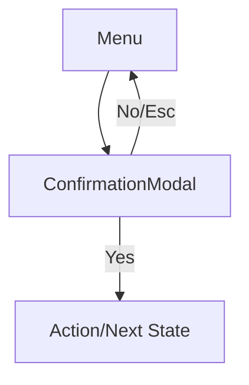
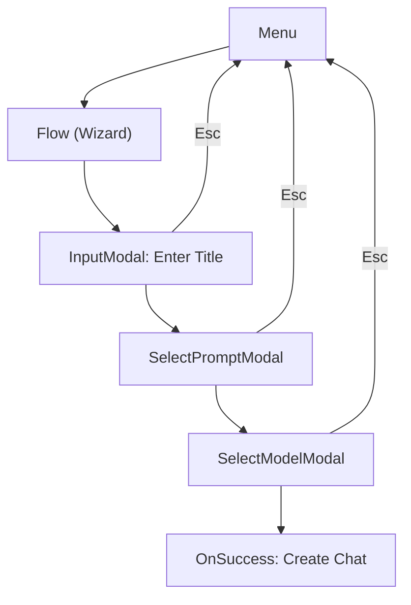

# Modal and Multi-Step Flow Architecture

---

**This document is the canonical reference for the modal and flow system architecture.**
- For overall architecture and rationale, see [design.md](design.md).
- For file-by-file structure, see [structure.md](structure.md).
- For composite chat view, see [chatview.md](chatview.md).
- For design patterns and decisions, see [considerations.md](considerations.md).

---

## Table of Contents
1. [Purpose & Scope](#purpose--scope)
2. [Modal Types](#modal-types)
3. [Flow System (Multi-Step Flows)](#flow-system-multi-step-flows)
4. [Integration & Extensibility](#integration--extensibility)
5. [Visual Flow Diagrams](#visual-flow-diagrams)
6. [Design Patterns & Best Practices](#design-patterns--best-practices)
7. [Cross-References](#cross-references)

---

## Purpose & Scope
This document details the design, implementation, and extensibility of the modal and flow system. It is the canonical source for modal types, flow orchestration, and integration patterns. For system-wide context, see [design.md](design.md#modal--flow-system).

---

## Modal Types
Each modal is a self-contained struct implementing a common interface (e.g., ViewState). Modal types include:
- **Confirmation Modals**: Yes/No or multi-choice confirmation dialogs (see `components/modals/dialogs/confirmation.go`).
- **Input Modals**: Single-line or multi-line text input dialogs (see `components/modals/editor.go`).
- **Notice/Information Modals**: Display a message, optionally with a title, and a single dismiss action.
- **Error Modals**: Specialized notice for error messages.
- **Help/About Modals**: Show keybindings, usage info, or app info.
- **Selection List Modals**: Choose from a list of items (chats, models, prompts, API keys, etc.).
- **Editor Modals**: Multi-line text editor modal.
- **Custom Modals**: For future extensibility.

All modals are extensible: add new modal types by defining new structs and logic. Each modal should be decoupled, reusable, and implement the ViewState interface for navigation/controller compatibility.

---

## Flow System (Multi-Step Flows)
A Flow represents a multi-step process, composed of an ordered list of modals and state/context for user input.
- **Custom Chat Creation Flow**: Sequence of Input, Model Selector, Prompt Selector.
- **API Key Addition Flow**: Sequence of Input (title), Input (key), Input (URL).
- **Any wizard-style process**: Sequence of modals, with state/context and onExit/onSuccess.

Flows are modular and reusable: handle both success and exit/escape cleanly. Add new flows by defining new sequences of modal ViewStates and orchestration logic.

---

## Integration & Extensibility
- **Modal Manager**: Centralized modal stack, decoupled from main view stack (see `modals.go`).
- **Navigation Controller**: Manages modal stack, flow advancement, and return to parent state (see `navigation/controller.go`).
- **Types & Interfaces**: All modal and flow types are defined in `types/modals.go` and `types/view_state.go`.
- **Views**: Modal rendering logic is in `views/` (see `views/flow/flow.go` for flows).
- **Components**: Reusable modal components are in `components/modals/`.

For file-by-file structure, see [structure.md](structure.md). For integration with composite chat view, see [chatview.md](chatview.md).

---

## Visual Flow Diagrams
### A. Single-Step Modal Flow

### B. Multi-Step Modal Flow (Wizard)

---

## Design Patterns & Best Practices
- **Flow-Based Modal Management**: Multi-step flows are implemented as sequences of modals, managed by FlowViewState.
- **Decoupling**: Navigation, GUI, data, and views are separated by clear interfaces.
- **Extensibility**: Add new modal types or flows by defining new structs and logic.
- **Immutability**: State transitions always create new instances.
- **Dependency Injection**: Context and controller are always passed, never global.

For more on patterns and anti-patterns, see [design.md](design.md#design-patterns--anti-patterns) and [considerations.md](considerations.md).

---

## Cross-References
- [design.md](design.md#modal--flow-system): System-wide context and rationale
- [structure.md](structure.md): File-by-file structure
- [chatview.md](chatview.md): Composite chat view architecture
- [considerations.md](considerations.md): Design patterns and decisions

---

*Sections of this document are mirrored or summarized in [design.md](design.md). For canonical details on modal and flow system architecture, use this file. For system-wide context, always consult design.md and structure.md.* 